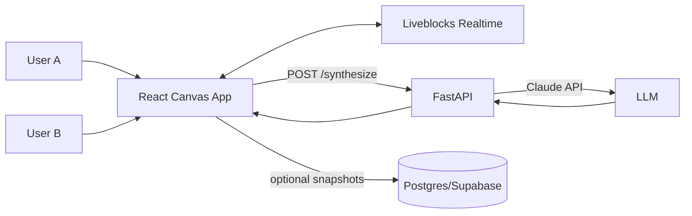

# Braindump Implementation Plan and Architecture

## Goal
Build a polished, pastel, note-taking-first collaborative canvas in 8 hours with:
- Real-time collaboration
- AI synthesis of board content
- Clean dynamic UI aligned with the design guide

This plan is optimized for hackathon speed and demo reliability.

## Recommended Stack

### Frontend
- React + Vite
- tldraw for infinite canvas interactions
- Tailwind CSS for fast visual styling and pastel theming
- Liveblocks client SDK for presence and shared realtime state

### Backend (Python)
- FastAPI
- Uvicorn
- HTTPX for outbound AI calls
- Pydantic models for strict request and response contracts

### AI
- Claude API via FastAPI endpoint

### Optional Persistence
- Supabase Postgres for board snapshots and history (can be deferred)

## High-Level Architecture



## Why This Split Works
- Live collaboration is hardest to build safely under time pressure.
- Liveblocks handles concurrency, presence, and state sync.
- FastAPI handles the product brain: synthesis, clustering, color extraction, orchestration.
- Frontend remains focused on user experience and visual quality.

## 8-Hour Execution Plan

### Hour 0-1: Project Setup
- Initialize frontend app
- Initialize backend app
- Create shared environment variables
- Confirm CORS and local networking

Deliverable:
- Frontend and backend both boot locally

### Hour 1-2.5: Realtime Canvas
- Mount tldraw canvas in React
- Integrate Liveblocks room connection
- Show live presence and shared edits

Deliverable:
- Two browsers can edit one room live

### Hour 2.5-4: Note Capture Features
- Add text note quick capture
- Add image drop/upload nodes
- Add link and code-note variants
- Add category tags and pastel styles

Deliverable:
- Multi-modal note creation on one board

### Hour 4-5.5: AI Synthesis
- Implement FastAPI /synthesize endpoint
- Convert board snapshot into compact prompt context
- Return structured brief JSON
- Render synthesis panel in frontend

Deliverable:
- Click Synthesize and receive usable brief output

### Hour 5.5-6.5: Organization and Visual Polish
- Island grouping visuals
- Connection labels
- UI shell polish (top bar, side panel)
- Loading and error states

Deliverable:
- Clean organized look with dynamic behavior

### Hour 6.5-7.5: Demo Hardening
- Add fallback synthesis when API fails
- Add sample seed board
- Add retry and timeout handling
- Confirm flows on second machine/browser

Deliverable:
- Demo-safe experience with backup behavior

### Hour 7.5-8: Deploy
- Frontend to Vercel/Netlify
- Backend to Render/Fly/Railway
- Set production env vars

Deliverable:
- Shareable live URL for judging

## API Contracts (FastAPI)

### GET /health
Purpose:
- Basic liveness check

Response:
```json
{
  "status": "ok",
  "service": "braindump-api"
}
```

### POST /synthesize
Purpose:
- Convert board chaos to structured team brief

Request:
```json
{
  "board_id": "room-123",
  "title": "AI hackathon concept",
  "nodes": [
    {
      "id": "n1",
      "type": "text",
      "text": "voice-first brainstorming",
      "tags": ["input", "ux"]
    }
  ],
  "edges": [
    {
      "from": "n1",
      "to": "n2",
      "label": "depends_on"
    }
  ]
}
```

Response:
```json
{
  "summary": "Short synthesis paragraph",
  "themes": ["Theme A", "Theme B"],
  "connections": [
    "Idea X supports Idea Y"
  ],
  "open_questions": [
    "What should be built first?"
  ],
  "next_steps": [
    "Build MVP canvas",
    "Validate with users"
  ]
}
```

### POST /cluster (optional)
Purpose:
- Suggest islands from node content similarity

### POST /extract-colors (optional)
Purpose:
- Return palette suggestions from image references

## Frontend-Backend Integration Flow
1. User edits board in realtime room.
2. Frontend serializes board state to a compact payload.
3. Frontend calls FastAPI /synthesize.
4. FastAPI calls Claude and returns structured brief.
5. Frontend displays synthesis in right panel and optionally pins actionable cards back onto board.

## Data Model (MVP)

### Node
- id
- type (text, image, voice, link, code)
- content
- tags
- position
- author
- created_at

### Edge
- id
- from
- to
- label

### SynthesisResult
- summary
- themes[]
- connections[]
- open_questions[]
- next_steps[]

## Reliability and Demo Safety
- Add request timeout for AI calls
- Add fallback mock synthesis when AI fails
- Cache last successful synthesis per board
- Never block UI while waiting for synthesis

## Risks and Mitigations

Risk:
- Realtime sync complexity
Mitigation:
- Use managed Liveblocks primitives, do not custom-build sync

Risk:
- AI latency spikes
Mitigation:
- Show progress UI and keep a fallback local summary

Risk:
- Overbuilding visuals
Mitigation:
- Keep one polished path: dump -> connect -> synthesize

## Definition of Done (Hackathon)
- Two users can edit the same board live
- User can add text and image notes quickly
- User can connect notes and see organized structure
- Synthesize returns structured brief in under 10 seconds average
- UI clearly matches pastel, clean, note-taking-first design intent

## Immediate Start Checklist
- Create FastAPI app and health route
- Add synthesize route with mock output
- Mount React+tldraw canvas
- Integrate Liveblocks room provider
- Connect synthesize button to backend

## Next File Targets
- backend/app/main.py
- backend/app/schemas.py
- backend/.env.example
- backend/requirements.txt
- frontend/src/App.tsx
- frontend/.env.example

Use this plan as the source of truth for build order.
